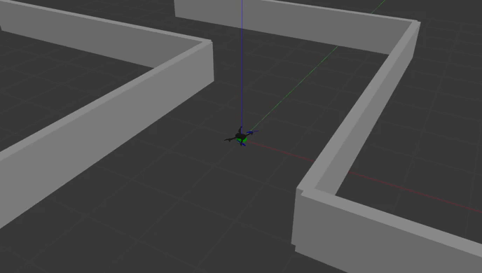

# UAV - PX4

## Project Overview

This project provides a C++ based UAV simulation and control framework built on ROS 2 and PX4, designed to support both research and practical applications in autonomous flight. It offers a flexible environment for developing, testing, and validating algorithms for path planning and control, allowing UAVs to generate safe trajectories and maintain stable performance during missions. The framework integrates with Gazebo Classic for high-fidelity simulation, supports custom maps and vehicle models, and leverages Micro XRCE-DDS for communication between PX4 and ROS 2.

## Project Setup

### Step 1: Basic setup

- Install [ROS 2 Humble](https://docs.ros.org/en/humble/Installation/Ubuntu-Install-Debs.html) on Ubuntu 22.04

- Install colcon to build ROS 2 packages (v0.18.4)

### Step 2: Download firmware

- Download [PX4 firmware](https://docs.px4.io/main/en/dev_setup/building_px4.html) (v1.15.1)
```
git clone -b v1.15.1 --recursive --depth 1 https://github.com/PX4/PX4-Autopilot.git
```

- Install [Gazebo-Classic 11](https://docs.px4.io/main/en/sim_gazebo_classic/) (simulation env)
```
sudo apt remove gz-harmonic
sudo apt install aptitude
sudo aptitude install gazebo libgazebo11 libgazebo-dev
sudo apt install libopencv-dev protobuf-compiler libeigen3-dev libgstreamer1.0-dev libgstreamer-plugins-base1.0-dev
```

- Install [XRCE-DDS](https://docs.px4.io/main/en/ros2/user_guide.html#setup-micro-xrce-dds-agent-client) (v2.4.3) (bridge between PX4 and ROS 2)
```
git clone -b v2.4.3 --depth 1 https://github.com/eProsima/Micro-XRCE-DDS-Agent.git
cd Micro-XRCE-DDS-Agent
mkdir build
cd build
cmake ..
make
sudo make install
sudo ldconfig /usr/local/lib/
```

- Clone [uav_px4](https://github.com/mmhai202/uav_px4) project

### Step 3: Project Config
**Build map**

- Create map: Add file `my_world.world` to the following path:  
*home/DevPX4/PX4-Autopilot/Tools/simulation/gazebo-classic/sitl_gazebo-classic/worlds*

- Run map: 
```
gazebo ~/DevPX4/PX4-Autopilot/Tools/simulation/gazebo-classic/sitl_gazebo-classic/worlds/my_world.world
```

- Add map: Open file `sitl_targets_gazebo-classic.cmake` in the following path, then add `my_world` to `set(worlds)`   
*home/DevPX4/PX4-Autopilot/src/modules/simulation/simulator_mavlink*

**Build model**

- Creat model param: Place file `10050_gazebo-classic_my_vehicle` in the following path, then add it to `px4_add_romfs_files()` inside `CMakeLists.txt`  
*home/DevPX4/PX4-Autopilot/ROMFS/px4fmu_common/init.d-posix/airframes*

- Create model: Add folder `my_vehicle` in the following path  
*home/DevPX4/PX4-Autopilot/Tools/simulation/gazebo-classic/sitl_gazebo-classic/models*

- Add model: Open file `sitl_targets_gazebo-classic.cmake` in the following path, then add `my_vehicle` to `set(modles)`  
*home/DevPX4/PX4-Autopilot/src/modules/simulation/simulator_mavlink*

- Set model to the origin in simulation: Open file `sitl_run.sh` in the following path, then search for "spawn-file" and chane (x,y,z) to `-x 0.0 -y 0.0 -z 0.83`  
*home/DevPX4/PX4-Autopilot/Tools/simulation/gazebo-classic*

### Step 4: Build and Run project

Open some terminals

- Terminal 1: run PX4 firmware
```
cd PX4-Autopilot
make px4_sitl_default gazebo-classic_my_vehicle__my_world
```

- Terminal 2: run the comunication of ROS 2 and PX4
```
MicroXRCEAgent udp4 -p 8888
```

- Terminal 3: run uav_px4 project
```
cd uav_px4
colcon build
source install/setup.bash
ros2 run uav_control uav_control
```


### Step 5: Upload firmware to Pixhawk
```
cd DevPX4/PX4-Autopilot
make <px4_board> upload
```
